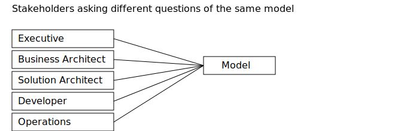
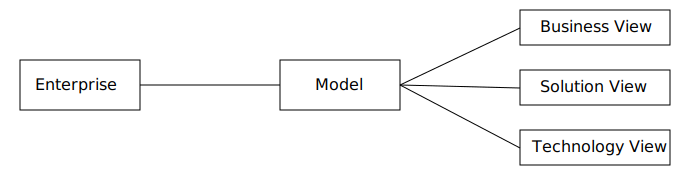

### Episode 1 

> Architecture is not measured by the number of diagrams we produce. It is measured by the number of conversations we make clearer.

Over the years I have seen organizations invest countless hours in creating architecture diagrams. Some ended up in PowerPoint decks, some in wikis, some in modeling tools. Many were visually impressive. Yet a few months later, they had become outdated, disconnected from reality, or simply forgotten.

The problem was rarely the notation or the tool. The problem was that the diagram had become the goal.

For me, architecture has never been about drawing boxes and arrows. It is about helping people understand how an enterprise works, why decisions are made, and how change can happen safely. Diagrams support that conversation; they should never replace it.

This series is about that philosophy. We'll use ArchiMate as a language and Archi as our primary modeling tool, but neither is the destination. They are instruments that help us build a shared understanding.

## Architecture is communication

Every stakeholder asks different questions.

* An executive wants to understand business impact.
* A business architect wants to understand capabilities and ownership.
* A solution architect wants to understand applications and integrations.
* A developer wants to know where a change belongs.
* Operations wants to understand deployment and runtime dependencies.

These are not different realities. They are different perspectives on the same enterprise.

The role of an architect is to tell the same story in a way that each audience can understand.

## One model, many stories

A mistake I often see is creating a new diagram for every meeting. Each diagram evolves independently until they contradict one another.

Instead, I prefer to build a single architecture model.

From that model I create multiple views, each answering a specific question for a specific audience. The model becomes the source of truth. The diagrams become windows onto that truth.

This distinction is subtle but fundamental. A diagram is temporary. A model accumulates knowledge.

Imagine our fictional company, **GridFlow Transmission**, operating a high-voltage electricity network.

The CEO wants to understand which business capabilities support maintenance of the network.

A solution architect wants to understand which applications support outage management.

An infrastructure engineer wants to know where those applications are deployed, which ones are most critical and where a specific technology is used.

Three conversations. One enterprise. One model.

## Why diagrams fail

Architecture diagrams usually fail for predictable reasons:

* They try to answer every question at once.
* They mix business, application and technology concerns.
* They include every available relationship simply because the notation allows it.
* They are created once and never maintained.
* They have no clear audience.

Whenever I draw or review a diagram, I ask one question:

> Who is this diagram for?

If the answer is "everyone", it is probably useful for no one.

## The model outlives the project

Projects finish. Teams change. Systems evolve.

A well-maintained model becomes an asset that survives those changes.

The next initiative starts with knowledge that already exists instead of rediscovering it from scratch. New viewpoints can be generated without rebuilding everything, just by reusing
what is already in the model. The model becomes a living representation of the enterprise, not a static artifact. 
The result of one initiative becomes the starting point for the next.

That is why I invest more energy in the quality of the model than in making individual diagrams beautiful.

## What you can expect from this series

Over the coming weeks we'll gradually build the architecture of GridFlow Transmission (or at least a significant portion of it).

We'll start with business architecture, move into domain architecture, continue with solution and technology architecture, and eventually discuss governance and practical tooling.

Along the way I'll share the modeling conventions that have proven valuable in practice. They are not presented as universal standards. 
They are conventions that consistently improved communication within architecture teams.

Whenever appropriate, each article will include:

* A downloadable Archi repository.
* High-resolution diagrams.
* A PDF-ready version.
* A practical modeling checklist.

My goal is not to teach you every element of ArchiMate.

My goal is to help you build architecture models that people actually use.

## A convention to remember

**Every diagram should answer one primary question for one primary audience.**

When a diagram tries to answer everything, it usually explains nothing.

In the next episode we'll define the modeling principles that will guide the rest of the series, 
including naming conventions, viewpoints, relationship choices and the deliberate restrictions that keep our models understandable.
